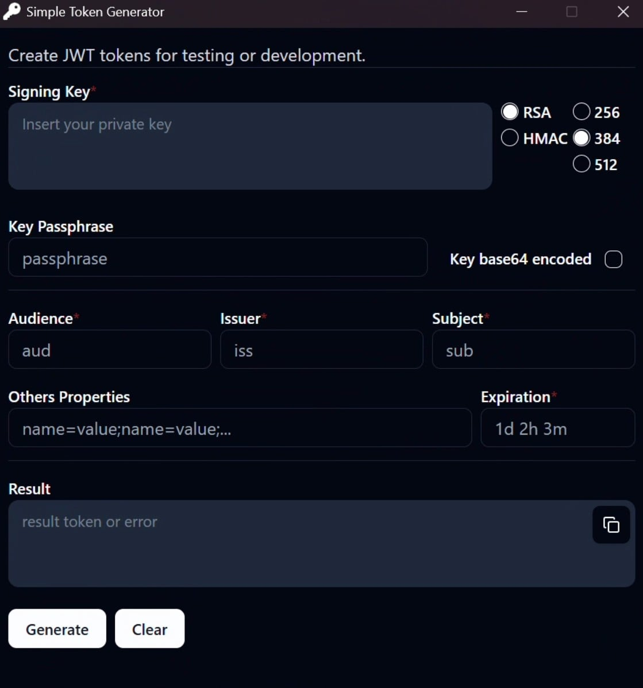

# Simple Token Generator

## Description

This is a simple desktop application built with [Tauri](https://tauri.app/) to generate signed JWT tokens. It supports RS256, RS384, RS512, HS256, HS384, and HS512 signature algorithms, allowing developers to test and develop applications that use JWT authentication.

## Features

- Generate JWT tokens for testing and development
- Support for RS256, RS384, RS512, HS256, HS384, and HS512 algorithms
- Option to insert private key and passphrase
- Configuration of claims such as _audience_, _issuer_, _subject_, and extra properties
- Flexible expiration time settings
- Simple and intuitive interface

## Screenshot



## How to Run

1. Clone this repository:
   ```sh
   git clone https://github.com/your-username/simple-token-generator.git
   ```
2. Navigate to the project directory:
   ```sh
   cd simple-token-generator
   ```
3. Install dependencies:
   ```sh
   npm install
   ```
4. Run the application in development mode:
   ```sh
   npm run tauri dev
   ```
5. To generate a build:
   ```sh
   npm run tauri build
   ```

## Requirements

- Node.js and npm installed
- Rust installed (required for Tauri)
- Tauri CLI installed globally:
  ```sh
  cargo install tauri-cli
  ```
- OpenSSL installed
- Perl installed (required for compiling OpenSSL)

## License

This project is licensed under the [Apache 2.0 License](LICENSE).
